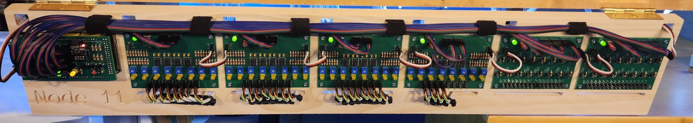

# My Journey (In Development)
*A personal log of discovery, tinkering, and the joy of automation in model railroading.  
Last Updated - October 2, 2026*

## A Little Background
I first discovered Bruce Chubb's C/MRI system in the early 2000's, at that time I purchased some pre-made boards and only messed aroud with it for a short time.  Much of what I wanted to accomplish at that time I was able to do with relays, transistors, switches, and LEDs so I didn't move forward very much with it.  I believe the reason is the model railroad software I was aware of at that time didn't have the sophistication and capability we see today with JMRI.  For many years, I used first an NCE system, then an ESU solution to control my locomotives and turnouts; everything else was pretty much those solid state devices I referred to above.

### Discovery of JMRI

All  of that changed when I discovered JMRI and started a six year journey into deeper control, integration, and automation, and little did I know just how deep that would go.  Though this journal is focused on my transition from an RS-485 based C/MRI integration to a network based C/MRI integration, some of this background could be helpful in understanding the 'why' behind what I've done.

### What I Love about the Hobby

I love the electrical design and programming aspect of this multi-faceted hobby and that's where I spend almost all of my time, you'll notice it immediately when you see my layout and the non-existing landscaping.  I'll get around to that someday, but right now I'm spending the limited time I have on the activities I enjoy most.  My layout is not large, it's a 16' x 20' area in the shape of a backwards letter 'P' where the layout is staged along the walls as it wraps around a stairway.  It's a double mainline with multiple crossovers, two yards, a few several staging tracks, and a couple of industry stops.  

### And What I Didn't

One of the chores I hated and is a common thread amnong hobbyists is cleaning the track.  Fortunately, I found the right mix and application of cleaning cars and process that eliminated hand cleaning the track, unfortunately, running my cleaning consist was both time consuming and boring.  

Several years ago I stumbled upon the first in a series of videos in the Little Wicket Railway channel, specifically [Arduino, CMRI and JMRI - Part 1 - Combined Sensors and Servos](https://youtu.be/OkXG3mfY6PE?si=E9V7w1xjb-dBlRoQ).  The video gave me an idea, install sensors at strategic points in the layout to detect when the cleaning consist train needed to either change direction or be shifted to another track.  After a few weeks I had a fully automated track cleaning script where I simply setup the consist at a designated starting position and ran it.

### What I Didn't Expect

When cleaning the track, I actually found I enjoyed sitting back and watching the trains run automatically.  Clean a track, shift another train currently parked in the next location to clean, and repeat until the whole layout was cleaned.  This started a whole new endeavor which involved the installation of over 250 sensors monitoring all segments of track, moving from DCC based turnout control to C/MRI control, and even transitioning my static lighting into C/MRI so I can futher extend the realism with reactive lighting effects.

## Where I Am Now

I currently have 332 C/MRI devices primarily comprised of sensors, followed by turnout control with positional feedback, and lighting control all across 9 C/MRI nodes on a single RS-485 network.  I've had this in place for at least two years now and make heavy use to automate operations and execute 'scenes' running and coordinating many trains at the same time allowing me to sit back and enjoy the layout as a spectator.  It's been reliable and a whole lot of fun.

### So Why Change It?

I have more ideas, more things I want to do which is going to require my C/MRI network to grow and there are tradeoffs with that growth.  When I started with just a few nodes, my RS-485 network was small and with that, I was able to run at 115200 baud and poll all of those sensors quite rapidly.  However, my network has expanded and with that physical extension I wasn't able to continue at 115200 baud and had to step it down to 57600 impacting the poll rate.  Additionally, I at least quadrupled the number of nodes which further reduced the poll rate for all of the sensors as there were more nodes to communicate with sequentially.  

The biggest impact is when an issue did occur with the RS-485 network, it took all of the nodes down, and started a lengthy process of working to determine whether it was a wiring issue in the network or a node causing noise or errors on the line.  That last one is why I started looking into how to develop a network based C/MRI node.

## What's the Latest?

### October 2026

On October 1, I noticed that a feature request I contributed to back in March in the JMRI Groups.io community was implemented as part of JMRI 5.17.3 Test Release.  One of the challenges with the new network based C/MRI module was if there was a network issue and the connection from the JMRI workstation and the new C/MRI module was disrupted, JMRI would display an error with that connection and required a restart to reconnect.  This doesn't happen often, but when it does, its impact was big.  In 5.17.3 they implemented an update to C/MRI network nodes providing an automatic reconnect attempt like they have in place to network based DCC Command stations.  I updated my JMRI workstation to this new test release and am happy to report that this new feature works perfectly.  Thank you JMRI Developers!

### September 2026

With Fall approaching, more time is being spent on indoor activities which means more time with the train layout.  In March 2026 I finished all of the shield and module design and testing and ordered all of the components and custom made boards to retrofit all my C/MRI nodes.  I assembled all of the modules and also designed and CNC'd panels to organize and support each node with all of it's modules.  I also pre-wired all of the data lines for four of the nine new panels.  

It is now time to start the conversion and I started with the new Node 11.  I took the opportunity to re-make all of the data lines between the sensor devices and the panel and completed the whole conversion after a few days.  I've been "burning" it in to ensure it's just as reliable in operation as it's RS-485 counterpart.  Below is a picture of the new node installed.

During the "burn in" period, I did notice an issue with the laptop I'm using as a JMRI workstation and the new network node.  Periodically, the sensors on that node would flash red for a second or two as if offline and return to their proper state.  I was able to identify the issue as the driver for my wireless adapter in Ubuntu.  It appears to be well known where every 60-120 seconds there would be a spike in network latency, this latency coincided with the sensor "blink".   I changed to a wired adapter and it's been working great ever since.

## Reference Projects
Find this journal and wonder what it's referring to?  

- **Arduino Mega CMRI WiFi**  
  Arduino sketch for Mega 2560 to operate as CMRI Node with an ESP8266-ESP01 providing WiFi connectivity.
  https://github.com/scostella/Arduino_Mega_CMRI_WiFi

- **ESP8266 WiFi Setup Utility**  
  ESP sketch to program the ESP8266-ESP01 to work with the Arduino Mega 2560 and connection configuration for your WiFi network.
  https://github.com/scostella/ESP8266WiFiSetup

- **KiCad Custom Library**  
  Library containing all project parts in all designs.
  https://github.com/scostella/KiCadLibrary

- **Arduino Mega CMRI WiFi Shield**  
  KiCad design for a shield for the Arduino Mega 2560 facilitating easy integration with the ESP8266-ESP01 and the CMRI modules listed below.
  https://github.com/scostella/Arduino_Mega_CMRI_WiFi_Shield

- **Arduino Accessory Controller**  
  KiCad design for a board to control accessories up to 1 amp.
  https://github.com/scostella/Arduino-Accessory-Controller

- **Arduino IR Sensor Module - 8 Port**  
  KiCad design for a board to use TCRT5000 IR module to sense object presence which can also be used in the Arduino Mega CMRI WiFi module to group sensors to create virtual block detection.
  https://github.com/scostella/Arduino_IR_Sensor_Module_-_8_Port

- **Arduino Tortoise Controller with Feedback - 8 Port**  
  KiCad design for a board to control Circuitron Tortoise Slow Motion Switch machines and provide feedback on switch position either controlled internally by the voltage applied to the tortoise or an external signal.
  https://github.com/scostella/Arduino_Tortoise_Controller_with_Feedback_-_8_Port

- **Arduino Light Controller**  
  KiCad design for a board to control low amperage lighting and other loads (<10ma) using the Arduino's 5V source.
  https://github.com/scostella/Arduino-Light-Controller

These projects may be used together to form a complete CMRI‑controlled lighting and I/O system.